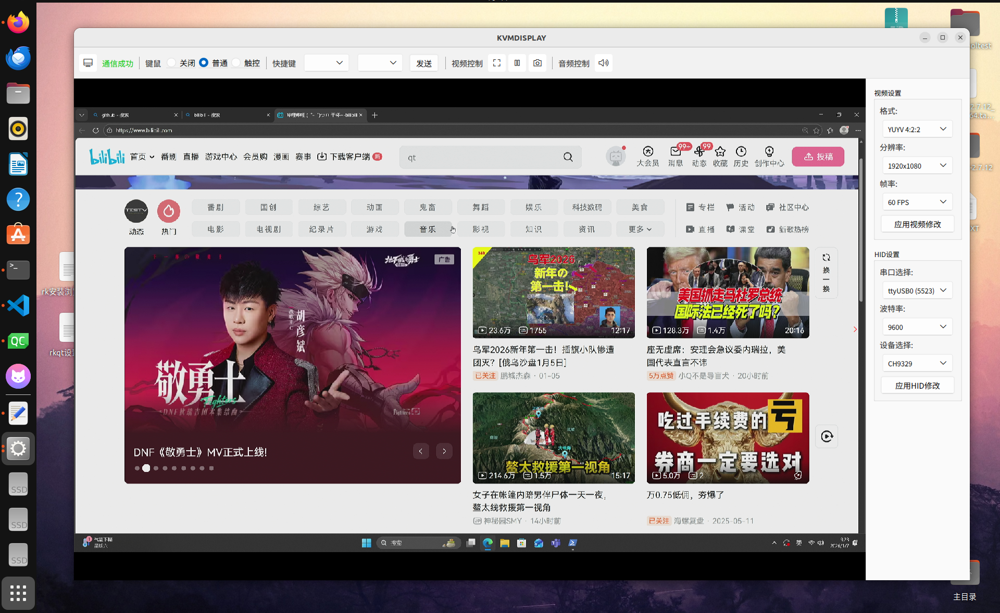

# PADSKVM

一个基于 Qt/C++ 开发的高性能嵌入式 **IP-KVM (Keyboard, Video, Mouse)** 解决方案。该项目运行在 Linux 平台上，通过 V4L2 采集 HDMI 视频信号，经过 H.264 编码后通过 WebSocket 推流到 Web 端，同时支持本地和远程的键鼠控制 (HID) ，通过 CH9329 硬件模拟器发送给被控端。



## 一、硬件说明
### 1.1 硬件清单
- HDMI采集卡（用于获取目标设备的图像数据）
- 串口模块与CH9329模块
- 运行Linux系统的主机（配有网卡）
- 配套连接线（HDMI线、串口线等）

### 1.2 硬件连接
1. HDMI采集卡输入端连接 目标设备 的HDMI输出口，输出端连接 运行本软件的Linux设备；
2. CH9329模块的串口端连接 本Linux设备 的串口，USB端模拟键鼠输入至 目标设备；

## 二、编译与运行

### 2.1 核心依赖
- Qt 5.15.3（图形界面开发框架）
- V4L2框架（Linux视频设备驱动框架，用于采集HDMI视频流）
- QSerialPort（Qt串口通信库，用于控制CH9329模块）
- ElaWidgetTools（仓库地址：https://github.com/Liniyous/ElaWidgetTools ）
- FFmpeg OpenSSL

### 2.2 x86架构Linux系统
1. 进入项目根目录：
   ```bash
   cd padskvm

   mkdir build && cd build

   qmake ../padskvm.pro

   make -j$(nproc)

   sudo ./padskvm
   ```

### 2.3 TSPI-RK3566开发板（ARM架构）
由于开发板为ARM架构，需指定ElaWidgetTools的ARM架构库文件路径，步骤如下：
1. 修改项目配置文件`kvmdisplay.pro`，添加ARM架构库路径：
   ```qmake
   LIBS += -L$$PWD/SDK/ElaWidgetTools/lib/arm -lElaWidgetTools
   QMAKE_RPATHDIR += $$PWD/SDK/ElaWidgetTools/lib/arm
   ```
2. 重复2.2中的步骤，完成编译并运行。


https://github.com/user-attachments/assets/be0b6e8c-1b00-4550-8f39-513f3b976266


## 三、软件架构

### 3.1 总体架构概览 (System Overview)

该系统采用 **多线程 (Multi-threading)** + **分层模块化 (Layered Modularity)** 的设计思想。主要分为三层：

1. **表现层 (UI/Presentation Layer)**：负责用户交互、视频预览和设备管理。
2. **控制与业务层 (Controller/Business Layer)**：负责核心业务逻辑、线程调度、状态同步和数据分发。
3. **驱动与硬件抽象层 (Driver/HAL Layer)**：负责直接操作底层硬件（V4L2, 串口, FFmpeg, Socket）。

---

### 3.2 模块详细设计 (Module Design)

#### A. 表现层 (UI Layer)

这一层运行在 Qt 主线程 (GUI Thread)，负责与用户交互。

* **设备发现与入口 (`ui_mainpage`)**:
* **职责**：系统入口。自动扫描 `/dev/video*` 节点，过滤出可用的采集卡，并检测设备占用状态（通过 `ioctl` 探测 Busy 状态）。
* **交互**：用户选择采集卡和串口设备后，启动显示会话。


* **主控界面 (`ui_display`)**:
* **职责**：KVM 会话的核心窗口。集成视频预览 (`QLabel`) 和侧边设置栏。
* **事件拦截**：通过 **Qt Event Filter** (`eventFilter`) 捕获用户在视频窗口上的鼠标点击、移动和键盘按键，拦截后转发给控制层。
* **组件化**：使用了自定义 UI 组件 (`ElaWidgetTools`) 提升界面美观度。

#### B. 控制与业务层 (Controller Layer)

这一层实现了 UI 与 硬件的解耦，主要由两个核心控制器组成。

* **视频/流媒体控制器 (`VideoController` / `pro_videothread`)**:
* **类型**：继承自 `QThread`，独立运行于子线程。
* **核心机制 - 硬件状态同步机 (`syncHardwareState`)**：这是代码的一大亮点。主线程只修改“配置参数”，子线程在每一帧循环开始时检测“脏标记 (Dirty Flags)”，从而在不销毁线程的情况下安全地重启摄像头、重建编码器或重置网络服务。
* **职责**：驱动摄像头采集、管理编码器生命周期、维护 WebSocket 服务器。


* **HID 输入控制器 (`HidController` / `pro_hidcontroller`)**:
* **核心机制 - 双向输入融合**：同时接收来自**本地 Qt 事件**和**网络 WebSocket 数据包**的指令。
* **指令队列**：使用单例队列 (`HidPacketQueue`) 缓存指令，并在定时器 (`onMainLoop`, 100Hz) 中取出执行，防止串口阻塞 UI。
* **坐标映射**：负责将 UI 窗口坐标/Web 坐标 映射到 CH9329 的 4095x4095 绝对坐标系。
* **模式切换**：支持绝对鼠标模式 (办公) 和 相对鼠标/触控模式 (游戏/触屏)。

#### C. 驱动与硬件抽象层 (Driver/HAL Layer)

这一层封装了具体的第三方库和 Linux 系统调用。

* **摄像头驱动 (`CameraDevice` / V4L2)**:

  使用原生 Linux `ioctl`, `mmap`；支持 V4L2 缓冲区队列管理 (Enqueue/Dequeue)；通过 `mmap` 直接访问内核缓冲区，仅在需要显示时进行格式转换 (YUYV -> RGB)。


* **视频编码器 (`VideoEncoder` / FFmpeg)**:

  使用`libavcodec`, `libswscale`库，配置为 `ultrafast` preset 和 `zerolatency` tune，禁用 B 帧，确保 KVM 操作实时性。实现 YUYV 到 YUV420P 的色彩空间转换。


* **HID 驱动 (`CH9329Driver` / Serial)**:
  
  使用`QSerialPort`库，封装了 CH9329 芯片的串口通信协议，生成键盘、绝对鼠标、相对鼠标的数据包。


* **Web 服务器 (`WebServer` / POSIX Socket)**:

  使用原生 Linux Socket, OpenSSL (SHA1/Base64 用于 WebSocket 握手)。提供 HTTP 服务 (加载 Qt 资源文件中的 `index.html`) 和 WebSocket 广播服务 (推送 H.264 裸流)。

### 3.3. 核心数据流 (Data Flow)


#### A. 视频流路径 (Video Path)

     drv_camera -> pro_videothread -> ui_display -> qt显示
                                   -> videoencoder -> drv_webserver

1. **采集**：`CameraDevice` 通过 V4L2 获取原始 YUYV 数据 (Kernel Space -> User Space via mmap)。
2. **分流**：
* **本地预览**：软转码 (YUYV -> RGB) -> `QImage` -> `VideoController` 信号发出 -> `ui_display` 缩放渲染。
* **网络推流**：`VideoEncoder` (YUYV -> YUV420P -> H.264) -> `WebServer` (WebSocket Frame) -> 浏览器端 (`jmuxer.js` 解码播放)。


#### B. 控制流路径 (Control Path)

    ui_display -> eventFilter -> push -> 入队  
    index.html -> drv_webserver -> push -> 入队
    
    pro_hidcontroller(onMainLoop)-> pop -> 出队 ->  drv_ch9329(sendMouseRel) -> 串口 -> 被控机


1. **源头**：

   本地：`ui_display` 捕获 `QMouseEvent`/`QKeyEvent`。

   远程：`WebServer` 接收 WebSocket 二进制包 -> 解析为 HID 命令。


2. **汇聚**：所有指令封装为 `HidCommand` 结构体，Push 进线程安全的 `HidPacketQueue`。
3. **执行**：`HidController` 的定时器循环 Pop 指令 -> 调用 `CH9329Driver` -> 写入串口 -> CH9329 硬件 -> 被控主机。


## 四、项目技术亮点 (Key Highlights)


1. **极低延迟架构 (Low Latency)**：
* FFmpeg 编码参数极致优化 (No Buffer, No B-frames)。
* V4L2 使用内存映射 (MMAP) 减少内存拷贝。
* Qt 渲染使用 `Qt::FastTransformation` 保证 UI 流畅。


2. **高可靠性线程模型**：
* 视频线程与 UI 线程分离，防止界面卡顿影响推流。
* 引入“状态同步机”机制，解决运行时动态切换分辨率/格式导致的资源竞争崩溃问题。


3. **跨平台/混合编程**：
* 结合了 Qt 的易用性 (UI, SerialPort) 和 Linux 原生 C 的高性能 (V4L2, Socket, FFmpeg)。
* Web 端采用无插件方案 (WebSocket + MSE/Canvas)，兼容性好。


4. **完备的 HID 协议实现**：
* 不仅支持普通键鼠，还完整实现了绝对坐标映射（解决鼠标漂移问题）和触摸屏模式的长按右键逻辑。


