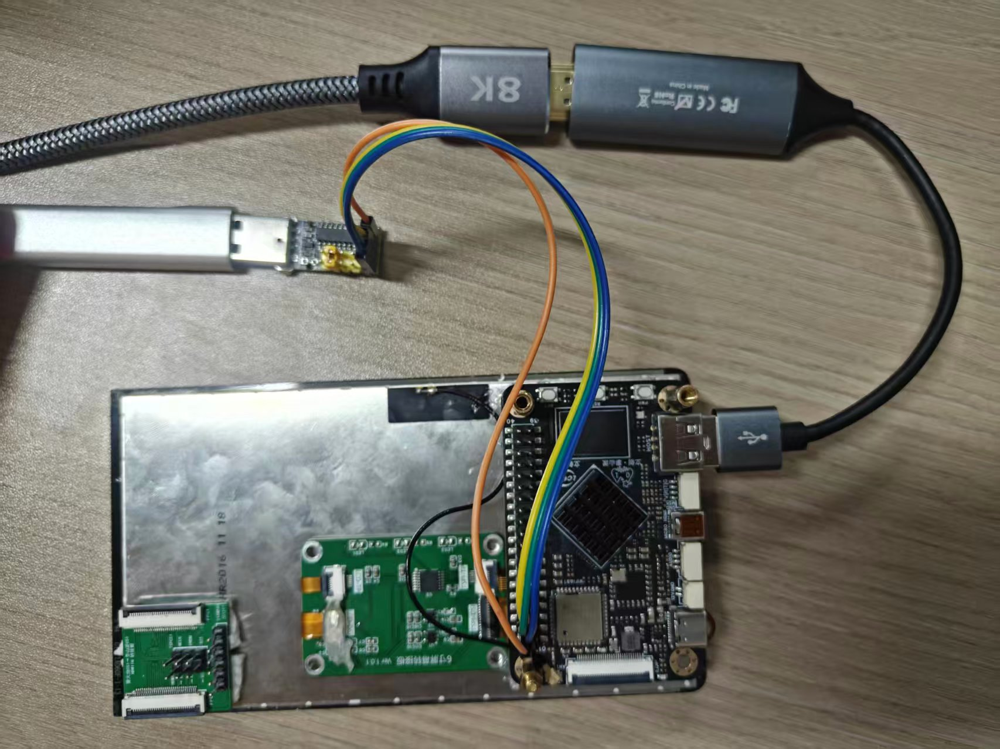

# TinyQTKVM
一款运行于Linux系统的KVM显示与控制软件，支持HDMI视频输入与串口模拟USB键鼠控制功能。


## 一、硬件说明
### 1.1 硬件清单
- HDMI采集卡（用于获取目标设备的图像数据）
- 串口模块与CH9329模块
- 运行Linux系统的主机
- 配套连接线（HDMI线、串口线等）

### 1.2 硬件连接
1. HDMI采集卡输入端连接 目标设备 的HDMI输出口，输出端连接 运行本软件的Linux设备；
2. CH9329模块的串口端连接 本Linux设备 的串口，USB端模拟键鼠输入至 目标设备；

## 二、软件架构
### 2.1 核心依赖
- Qt 5.15.3（图形界面开发框架）
- V4L2框架（Linux视频设备驱动框架，用于采集HDMI视频流）
- QSerialPort（Qt串口通信库，用于控制CH9329模块）
- ElaWidgetTools（仓库地址：https://github.com/Liniyous/ElaWidgetTools ）

### 2.2 核心功能
- 通过V4L2框架读取HDMI采集卡的视频流，并在Qt界面中实时显示；
- 通过QSerialPort与CH9329模块通信，模拟USB键盘/鼠标设备，实现对目标设备的控制。

## 三、编译与运行
### 3.1 x86架构Linux系统
1. 进入项目根目录：
   ```bash
   cd tinyqtkvm

   mkdir build && cd build

   qmake ../kvmdisplay.pro

   make -j$(nproc)

   sudo ./kvmdisplay
   ```

### 3.2 TSPI-RK3566开发板（ARM架构）
由于开发板为ARM架构，需指定ElaWidgetTools的ARM架构库文件路径，步骤如下：
1. 修改项目配置文件`kvmdisplay.pro`，添加ARM架构库路径：
   ```qmake
   LIBS += -L$$PWD/SDK/ElaWidgetTools/lib/arm -lElaWidgetTools
   QMAKE_RPATHDIR += $$PWD/SDK/ElaWidgetTools/lib/arm
   ```
2. 重复3.1中的步骤，完成编译并运行。


Uploading video.mp4…


